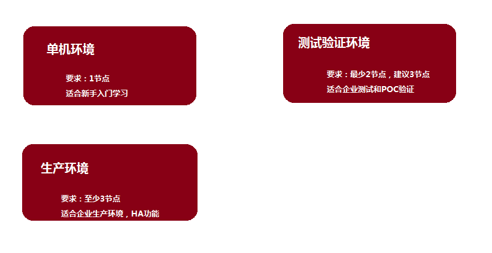
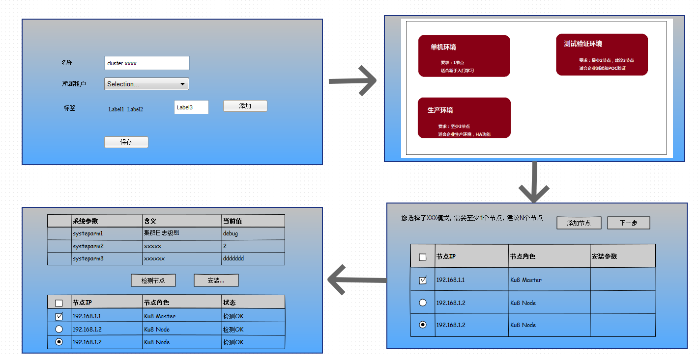
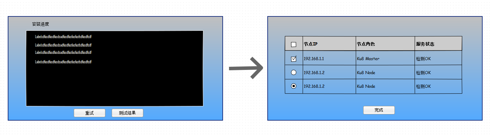

# Kubernetes集群安装的功能设计及实现

标签（空格分隔）： install

---

## 场景及功能

Kubernetes集群的安装部署有以下几种可能的场景：

 1. 一个全新的集群，第一次安装Kubernetes集群
 2. 已经安装好了集群，进行扩容，增加节点
 
安装过程，我们提供**向导安装模式**给用户，首先用户选择要安装的**集群模板**(ku8-cluster-template)，如单机环境、测试环境、生产环境（HA模式）等一些固定预制的模板，每个模板都有安装条件的要求，比如最少的节点数量，以及对应的安装脚本和参数等，通过模板的方式，我们比较容易的做一些扩展而不影响程序的结构。目前所想的集群模板有如下的数据结构：
 1. id:模板唯一标示，用来区分不同的模板
 2. name:模板名称，比如单机环境模板
 3. desc:模板描述
 4. logo-url:模板Logo的地址，用于界面展示
 3. 前提条件，比如{minNodes:3,maxNodes:5}表示最少3个节点
 4. params:模板参数
 5. detail-url:说明此模板的安装详细信息，一个HTML页面来说名此集群安装出来的效果，包括拓扑图
选择模板的界面如下所示，建议增加图标和更多信息：



接下来，用户给出待安装集群的名称，并录入一批待安装的目标节点地址，包括IP，root用户名，密码等信息，**数量**要符合所选模板里的最小最大个数，**下面的表格应该是根据模板里的定义来填充的，比如第一个阶段的角色默认是etcd、master、以后的是node等:**

 节点  |IP地址          |    Root密码|    节点角色    
 ------|----------------|------------|------------   
 1     |    192.168.0.1 |    123456  |  etcd、master    
 2     |    192.168.0.2 |    123456  |   node 
 3     |    192.168.0.3 |    123456  |    node

输入了节点机器以后，下一步生成预安装的界面，用户可以微调安装参数：

集群参数                 |    关联组件        |    当前值    |     说明      
-------------------------|--------------------|--------------|------------------------  
service-cluster-ip-range |API Server          |  10.0.0.1/16 |    Cluster IP的地址范围     
 node-sync-period        | Controller Manager |    10s       |  Node节点同步的时间间隔
 algorithm-provider      |    Scheduler       |    Default   |   Pod调度策略

用户确认安装节点和安装参数以后，点击开始安装，就开始执行集群的安装过程，具体做法为调用ansible脚本来驱动安装，安装过程中，ansible的输出流需要在页面上实时展示出来。安装完成以后，数据库里记录了集群、节点列表、集群组件等实体。

 - 集群(ku8_cluster)本身的基本信息，集群名称、唯一ID、集群的创建模板、创建时间等、标签，逗号分隔的多个标签，说明其用途，比如生成，测试，或者按业务来分等
 - 节点的基本信息则：集群Id，节点名称（主机名）、IP地址、Root密码、角色（Master、Node）等
 - 集群组件的信息有组件名称（如API Server）、服务地址、描述、状态、所在节点等信息。

下面是参考的界面以及流程：

首先创建一个Ku8 Cluster，填写必要信息，完成此步以后，在对应的Cluster表格里记录状态为待安装，然后用户选择一个安装模板，安装模板确定了第三步的表格以及内容，第三步中最好先把列表的行记录按照模板的默认值进行填充，比如3节点安装，就默认出现3行记录，IP地址为空，需要用户选择集群中没有使用的节点（clusterId为null的节点），如果加一行新的节点，则通常一般是Ku8 Node节点，参数也对应为Node节点的参数，**第三步非常建议根据模板的不同而设计为不同的输入页面，即一种模板对应一种界面**。点击“下一步”时候，需要验证参数的有效性，通过检查以后，进入下一步，此界面展示集群的系统参数，并允许用户修改，这一步里做一个节点检测，具体过程是调用ansible脚本完成SSH Key的生成以及免密码登陆的的配置，以免后继部分某些节点无法连接导致安装失败。
这一步完成以后，进入下一步之前，需要数据库里记录Cluster相关的这些Host的信息，Host上对应的服务的Endpoint信息等，然后开始后面真正的安装过程。
后继的安装过程如下图所示：


首先一个模拟命令行的界面，输出ansible调用的输出日志信息，然后尽可能有一个表格记录每个节点的当前安装步骤，这个过程是要刷新页面的，安装失败，可以重新安装，安装成功以后，可以检测环境的有效性,检测过程分为两步，首先ansible接口确定各个节点上的服务是否启动正常，然后调用API服务（从Host上对应的服务的Endpoint找API服务），来看集群中的节点都是否加入，以检测集群的正常性。

代码实现方面，则可以实现一个Java的Kubernetes安装服务，此服务完成


## 设计及实现
我们设计一个java对象**ku8ClusterTemplate**来表示一个集群的安装模板，记录了此模板的相关信息和安装参数，用来收集和展现安装过程中的用户界面。其定义如下：
```java
int[] nodeRange;//存放最少最大节点数量
enum templateType;//模板类型，用来区分不同的模板
HashMap<String,String> installParamMap;//存放安装参数
List<Node> nodes;//安装的节点列表
String logoURL;
String name;
String descNote;
```
设计一个Java服务**Ku8ClusterDeployService**，用来执行具体的安装过程，它有以下的几个方法：

 - getAvailableTemplates();返回ku8ClusterTemplate的一个列表，供前端选择展示给用户选择模板
 - checkTemplateValidate(ku8ClusterTemplate template)；检查当前模板的参数等是否满足要求，可以进行安装部署
 - InstallProcess installCluster(ku8ClusterTemplate template),使用该模板完成集群安装过程，返回InstallProcess
InstallProcess的定义如下：
```java
   volatile boolean finished;
   volatile boolean sucess;
   volatile PrintStream output;//当前安装输出流信息，页面展示效果
```


