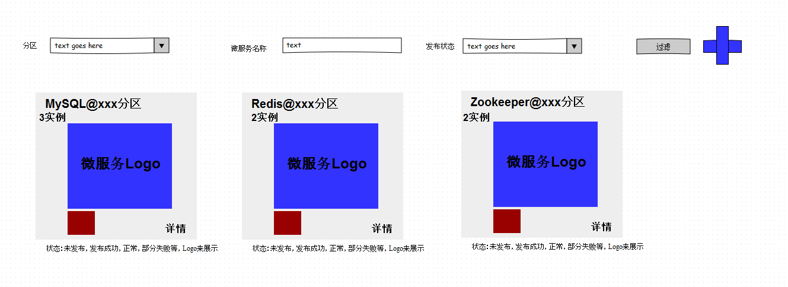
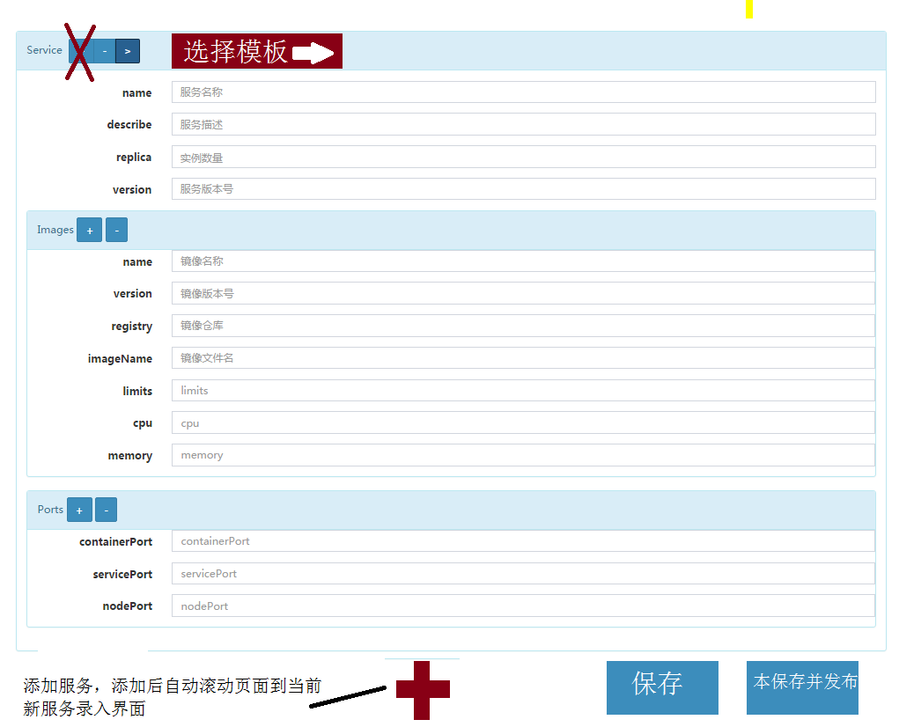
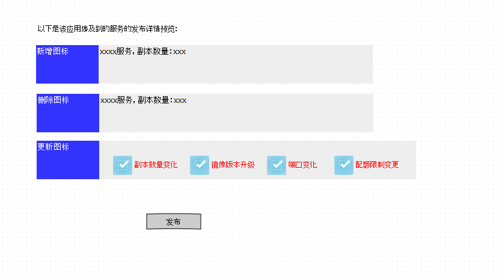

# Ku8微服务以及Ku8应用

标签（空格分隔）： ku8微服务 Ku8应用

---
   
1. **ku8微服务(Micro Service)**
----------------------------

等价与一个kubernetes的Service，但多了副本数的属性，每一个ku8微服务最终会实例化为一个kubernetes Service与对应的RC。ku8微服务本质上是独立的，彼此之间没有关系。ku8微服务分为公共的，以及属于某个私有的Application的两种，公共的微服务，可以被私有的Application引用（仅仅是依赖引用，并不是被包含在Application内）。Ku8微服务通过一个“定义阶段”，在界面上录入必要的属性，然后可以发布到某个ku8分区上部署，这个部署过程就是在对应的分区上创建相关的kubernetes service与RC，并且与之关联起来。

Ku8微服务相关的表为下面几个： 

- Ku8Service，对应一个微服务的定义，主要描述信息存放在jsonSpec里，为JSON格式的内容，projectid为NULL也是区分到底此服务是微服务还是内部服务的重要标志。

Ku8微服务的状态有以下几个：

 - 待发布
 - 发布中
 - 正常运行
 - 服务异常

Ku8微服务的主界面建议如下方式展现：

 
 点击“+”号，则可以创建一个微服务，可以从“模板”中选择或者直接进入微服务的构建界面：
 
 
 微服务的创建，直接在ku8_service里生成一个实例，projectid为NULL，具体的定义信息存在于jsonSpec属性中。微服务创建以后，可以“发布”到某个资源分区（Ku8ResPartion）上运行，发布过程流程大致如下：
 
-  用户选择待发布的资源分区（仅对于新服务来说，对于已有的服务，则只能再之前分区上更新，就跳过这一界面）  
-  查询该分区已发布的所有服务（状态除了KU8_MICRO_SERVICE_INIT_STATUS的），如果有重名的服务名并且并不是自身（可能重新发布），则提示该微服务名称已经被xxxx占用并报错
-  用户点击，首先保存数据，包括ku8_service里的资源分区信息、修改状态为KU8_MICRO_SERVICE_PUBLISHIING_STATUS，然后先调用后台k8s的API服务接口，在指定的分区的命名空间内，依次完成k8s service与k8s RC对象的创建或更新操作，调用成功以后，更新ku8_service的状态为KU8_MICRO_SERVICE_RUNNING_STATUS，并且把prevJsonSpec的内容设置为当前的内容， 如果这个过程中，如果有失败步骤，则设置ku8_service表的状态为 KU8_MICRO_SERVICE_FAILED_STATUS，并且ku8_service的note字段记录具体错误原因。

2. **ku8微服务模板**
---------------
微服务模板是一个用来快速实例化某个微服务的样板数据模型，常见的一些中间件都可以做成微服务模板，比如MySQL，Redis，Zookeeper，Memcache，MongoDB，FastDFS等。创建微服务的时候，可以直接选择某个微服务模板，修改必要的参数，然后发布到某个分区。微服务模板对应表ku8_service_template

3. **ku8应用（Application)**
---------------
Ku8应用是包括一组私有的K8微服务实例的一个整体单元，一个ku8应用可能会声明引用某些公共的Ku8微服务，与其自身包括的微服务不同，引用的微服务仅仅是确保这些微服务与它在同一个分区内存在，而不是去产生这样一个新的微服务。
     与Ku8微服务类似，一个ku8应用也有一个“定义节点”，即我们的Build阶段，在这个阶段中，用户通过界面定义一个或多个ku8微服务（也可以引用某个Ku8微服务模板），完成构建以后，选择某个ku8分区，发布每个微服务，在发布之前，需要确保它所引用的ku8微服务在此分区中存在。

一个Ku8应用包括如下的状态：

 - 待发布
 - 发布中
 - 正常运行
 - 部分服务异常
 - 服务全部异常

ku8应用所对应的表有两张：
   
- Ku8Project，用来保存应用本身的信息，如应用名称，版本号，发布人，时间等
- Ku8Service，与Ku8Project是一对多的关系，即Ku8Project中的每一个服务，都对应一条记录，projectid为NULL也是区分到底此服务是微服务还是内部服务的重要标志。

构建一个ku8应用的过程如下：

- 先创建一个Ku8Project
- 然后界面上添加多个服务并且输入服务的具体详情信息
- 最后点击保存的时候，为每个服务产生一条Ku8Service记录

ku8应用的编辑过程中需要注意一点，如果某个服务在界面删删除了，点击保存按钮保存服务的时候，需要判断对应的条Ku8Service记录中的Status属性，如果此服务是未发布状态，则可以直接删除对应的Ku8Service记录，否则需要标记FLAG为-1（Constants.DELETED_FLAG），在后面的发布过程中，删除对应的k8s资源信息（service 与RC）。

ku8应用的发布过程大致如下：

- 用户选择待发布的资源分区（仅对于应用来说，对于已有的应用，则只能再之前分区上更新，就跳过这一界面）  
-  查询该分区已发布的所有服务，如果有重名的服务名并且并不是自身（可能重新发布），则提示有服务名称已经被xxxx占用并报错
-  展示发布详情界面，提示用户当前所要执行的操作的内容，比如要创建或更新 k8s service、k8s RC  等资源，考虑到发布以及更新的复杂性，这里对比的参照信息来自k8s API 资源查询的结果，即当前ku8_service表里的微服务信息与k8s API 资源查询的结果进行对比并列出动作详情，比如创建或更新 k8s service 以及k8s
-  用户点击“发布”按钮，首先保存数据，包括ku8_service里的资源分区信息、修改状态为KU8_MICRO_SERVICE_PUBLISHIING_STATUS，然后先调用后台k8s的API服务接口，在指定的分区的命名空间内，依次完成k8s service与k8s RC对象的创建或更新操作，调用成功以后，更新ku8_service的状态为KU8_MICRO_SERVICE_RUNNING_STATUS，并且把prevJsonSpec的内容设置为当前的内容， 如果这个过程中，如果有失败步骤，则设置ku8_service表的状态为 KU8_MICRO_SERVICE_FAILED_STATUS，并且ku8_service的note字段记录具体错误原因。如果有部分服务发布失败，则标记Ku8Project的状态为KU8_APP_PART_FAILED_STATUS，，全部失败则标记为KU8_APP_FAILED_STATUS，全部成功则标记为KU8_APP_RUNNING_STATUS，对于发布失败的情况，则展示对话框，显示每个服务的状态，以及失败原因。

下面是参考的截图：

 

