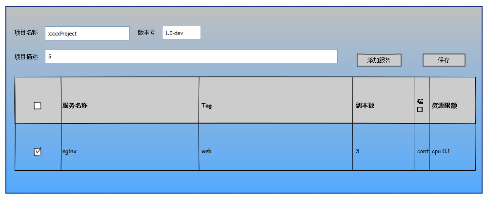
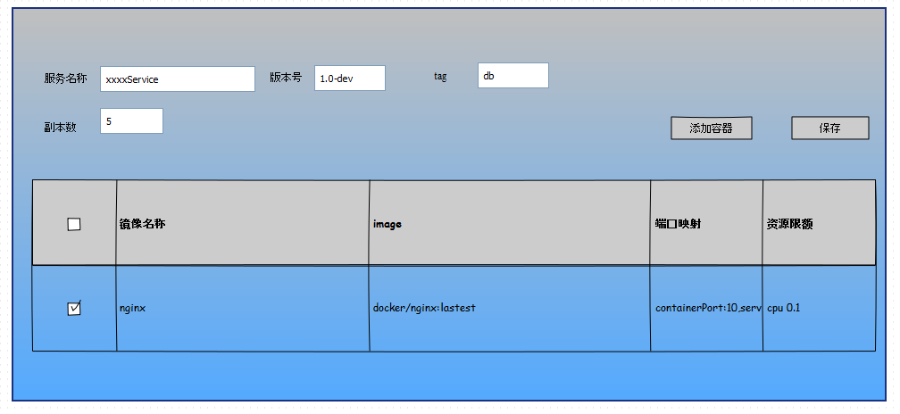

# Ku8 Project

标签： ku8-project

---

## 1. 为什么会有Ku8 Project
 
我们知道J2EE平台有WAR包以及EAR包标准规范，使得任何软件开发商所开发的符合J2EE规范的二进制部署包能够在很方便的发布到其他厂商的J2EE容器中运行。即使Docker平台上，也有标准的镜像格式来打包程序，但kubernetes作为一个新兴的分布式软件架构和运行平台，目前还没有一个标准的**程序打包规范**，部署过程目前都是命令行的冗长操作，这种低层次的的手工重复操作，工作量大，容易出错，不利于kubernetes上的程序开发和部署迁移，所以，我们在ku8eye项目中提出**ku8-project**的概念，并制定一个标准的kubernetes程序部署包标准，并配合一系列的工具来使得**ku8-project**的创建、开发、部署等任务变得简单方便。
     

## 2. Ku8 Project详解 
一个**Ku8 Project**是一个符合kubernetes架构并运行在kubernetes环境中的kubernetes项目，它用一个YAML格式的文件来描述工程（snakeYAML是Java里YAML参考的解析器）。参考示例如下：
```yaml
project:mykub8-project1
version:0.1
author:xxx@yyy.com
kuberneteVersion:v1
describe:demo kubernetes project
spec:
  services:
 - name: nginx
     describe:nginx service for my app
     tag:web
     replica:3
     version:0.1
     images: 
       - name:nginx
         version:latest
         registry:192.168.0.1:5000
         imageName:nginx.docker
         command:/bash/bin
         quotas:
            limits:
            cpu: 0.5
            memory: 128Mi
     ports:
      - containerPort: 80
        servicePort:8080
        nodePort:8888
```
我们注意到这里的定义是以Kubernetes Service为核心，一个工程包括多个Service定义，每个Service的定义包括了Kuberntes RC与Service的定义，以及其他必要部分，比如资源限额定义。
默认情况下，Ku8 Project部署到该用户所属租户的命名空间里，这样以来，每个租户的所有Project在同一个命名空间中，不同租户的Project是隔离的，大家可以用同样的服务名称。也可以发布到该用户自己的命名空间中，这样属于个人私有的项目，通常可以用于做测试、学习等目的。
一个**Ku8 Project**会打包为一个标准的zip格式的文件，目前计划包括如下内容：
 - 后缀名为.kub8的工程定义文件
 - docker镜像文件列表（导出的压缩文件）

## 3. Ku8 Project Builder
这是一个可视化的编辑工具，用于创建一个**Ku8 Project**，具体数据存储在MySQL域对象里（ku8project），项目定义文件(YAML)作为一个text字段完整的存储，定义过程中，主要是定义Service，Project的界面，除了展示基本信息职位，主要展示服务的列表信息，参考如下：


每个服务的定义界面参考如下，一个服务可以添加多个容器（通常为1个）：
 
 
## 4. Ku8 Project的发布过程
发布过程具体分为以下几步：

 - 选择发布的**目标环境**，比如所在的Cluster里的某个ku8 Group上，以及项目所在的**命名空间**，默认为租户自身的命名空间。
 - 根据目标环境和Project的定义信息，每个服务生成对应的一系列Kubernetes对象，包括RC、Service的定义等，如果是选择发布到某个Group上，则需要修改RC里Pod的NodeSelector属性，匹配指定的Group的Label。
 - 生成Project关联的部署实例表以及相关联的表（Ku8projInstance以及ku8projserviceinst、ku8projrcinst）
 - 顺序调用API Server的相关API，来生成上述对象

## 5. 相关设计
 **5.1 相关域对象**

 一：Ku8Project域对象，用来存储Ku8 Project的信息，主要由如下一些属性：

-  id:唯一标示
-  tenantId:所属租户
-  owner:工程所属人(对应登录用户userId)
-  name:工程名称：
-  version:工程版本
-  author：作者
-  kuberneteVersion：kubernetes版本
-  note:工程说明
-  yamlSpec:yaml定义内容，text类型，存储工程的yaml中spec部分内容
 
  二：Ku8projInstance域对象，是Ku8 Project发布后实例化对象，主要由如下一些属性：

-  id:唯一标示
-   projectId:对应Ku8Project域对象的主键，即属于哪个Ku8Project
-   zoneId:发布在哪个Zone里
-   ku8ClusterId:所在的ku8集群
-   ku8groupId:所在ku8集群的哪个group上，为空表示没有针对Group
-   namespace:所在的namespacke，发布时候要发布到该namespace
-   status:当前状态，比如正常，失败，已删除
  
三：ku8projserviceinst域对象，是Ku8projInstance关联的Kubernetes Service对象：

- id:唯一标示
- projectId:对应Ku8Project域对象的主键，即属于哪个Ku8Project
-  projectInstanceId:对应的Ku8projInstance域对象
-  zoneId:发布在哪个Zone里
-  namespace:所在的namespacke
-  name:kubernetes Service 定义中的名字
-  replica:服务副本数
  
 四：ku8projPodinst域对象，是Ku8projInstance关联的Kubernetes Pod对象：
 
- id:唯一标示
-  projectId:对应Ku8Project域对象的主键，即属于哪个Ku8Project
- projectInstanceId:对应的Ku8projInstance域对象
-   ku8projserviceinst:对应的ku8projserviceinst域对象
-  zoneId:发布在哪个Zone里
-  namespace:所在的namespacke
-  nodeId:所在的kubernetes Node节点
-  name:kubernetes Pod 定义中的名字
-  status:当前状态

 

  