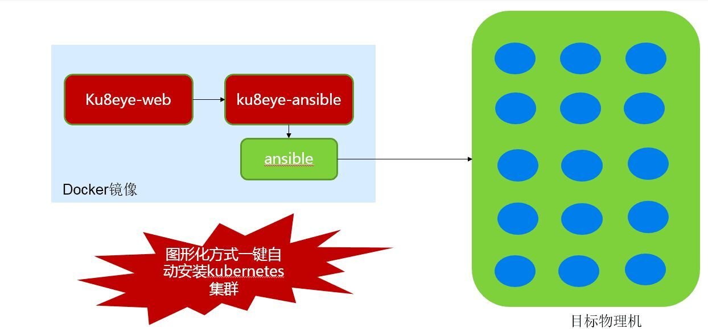
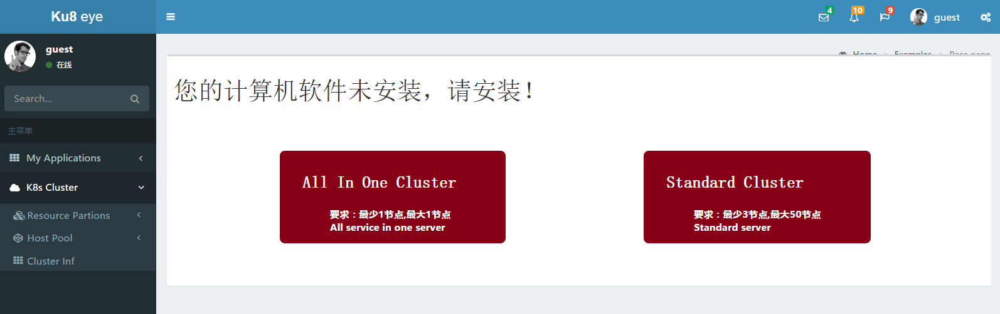

# 一，ku8eye安装

### 安装部署的架构图如下图所示。

###**注：运行ku8eye的服务器属于控制服务器，应在排除在目标Kubernetes集群的服务器范围之外，并能够与待安装的服务器之间网络连通。如需向私库中导入镜像，服务器需要与私库所在主机网络连通，并需要在服务器主机上配置docker启动参数，如：other_args='--insecure-registry xxx.xxx.xxx.xxx:xxxx'**###

当前版本的 **ku8eye** 以docker镜像方式提供，下载地址为：
http://pan.baidu.com/s/1bopnMYr
文件名说明：

 - ku8eye-web-xxx.tar.gz是ku8eye的docker镜像文件名
 - Value-packages/ku8_ext_files目录包括了ku8常用镜像包等资源

安装过程如下：
首先，下载ku8eye-web-xxx.tar.gz，用gunzip解压缩后，得到文件ku8eye-web.tar，下载Value-packages/ku8_ext_files文件夹，将这两个文件夹存放在Linux主机的KU8_EYE_HOME目录下，以下假设KU8_EYE_HOME目录是在/root/ku8eye.下面是安装前的目录结构
    /root/ku8eye/ku8eye-web.tar
    /root/ku8eye/ku8_ext_files

导入docker镜像：
`# docker load -i ku8eye-web.tar`
接着，给该镜像打上tag：
`# docker tag 6f46b1372b52 ku8eye-web`

运行ku8eye：
`docker run -tid --name ku8eye-web -v /var/run/docker.sock:/var/run/docker.sock -v /root/ku8eye/ku8_ext_files :/root/ku8eye/ku8_ext_files --p 3306:3306 -p 8080:8080 -p 9001:9001 ku8eye-web`
其中 3306 为mysql服务端口，8080 为tomcat服务端口，9001 为supervisor服务端口，均映射到宿主机上,-v表示本地的磁盘映射到容器内部路径上（前一部分为宿主机的本地路径，后面为容器内部路径）

如需映射sshd的22端口，需添加一个 -p 参数，例如 `-p 2222:22`

容器启动成功后，需等待15秒左右，等待mysql数据库与web应用启动完成。

# 二，运行ku8eye
打开浏览器，地址栏输入宿主机IP和8080端口，即可进入ku8eye-web页面。

对Kubernetes集群进行操作了。
## 1. 一键安装k8s集群
先添加主机信息，然后可以一键安装集群：
点击左侧“K8s Cluster”菜单，选择“Cluster Inf”进行安装。

此外，也可以通过命令行，一键安装kubernetes集群：
进入容器：`docker exec -ti ku8eye-web bash`
使用命令行完成一键安装Kubernetes集群，脚本为：
`/root/ku8eye-startup.sh $1 $2 $3`
**需要输入的3个参数为：**
**$1: 待安装主机IP地址列表，以逗号分隔。第一台主机将作为Kubernetes Master。例如：192.168.1.2,192.168.1.3**
**$2: docker0的B类IP地址，系统自动为每台主机设置docker0的C类地址，例如，输入 172.0.0.0/16，在两台机器上将分别设置docker0的地址为 172.0.1.0/24 和 172.0.2.0/24**
**$3: root用户的密码，目前仅支持所有主机相同的密码，例如：123456**

一个完整的命令行如下：
`/root/ku8eye-startup.sh "192.168.1.2,192.168.1.3" "172.0.0.0/16" "123456"`
> 注：每个参数需用双引号引起来

然后即可观察输出结果。

## 2. 导入ku8标准镜像包
接下来，需要导入初始的ku8镜像到系统中的Docker私有镜像库中，这些镜像在/ku8_ext_files/ku8_images目录下。
点击左侧“应用管理”菜单中点击“私库镜像”。
在页面中首先点击“设置私库镜像”查看是否存在私库地址，如不存在或不正确，则添加或修改后“确认”。
点击“镜像包导入”就可以按照提示导入镜像了。

建议使用上边网页的方式导入标准镜像包。

此外，也可以通过命令行导入镜像，我们需要先进入容器里，
`docker exec -it ku8eye-web bash`
运行进行包导入命令：
`/root/ku8-packages-import.sh /ku8_ext_files/ku8_images/ku8_images.tar.gz`

下面是此命令的详细说明：

第一个参数为要导入的gz包文件（完整路径）

第二个参数是clusterId，表示上传到该clusterId对应的私库里。第二个参数如果没输入，则默认是1。

镜像包导入成功以后，就可以进行下面的操作了。

如果想自己制作镜像批量导入压缩包，请参考[镜像批量导入压缩包制作](doc/ku8-images-file-make-guide.md)

## 3. 创建ku8微服务

# 附录，容器内包括的软件
## 1. Ansible安装环境，以及安装Kubernetes所需的全部软件
**Ansible的使用方法详见下文“Ansible安装Kubernetes集群说明”**
## 2. JRE1.8
**环境变量 JAVA_HOME=/root/jre1.8.0_65**
## 3. MySQL 5.7.9
**数据库名：ku8eye**

**数据库用户名：ku8eye，密码：123456**
## 4. ku8eye-web 应用
**jar包：/root/ku8eye-web.jar**
